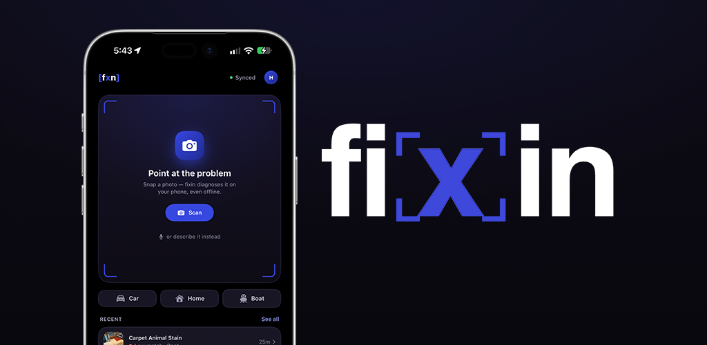

<p align="center">
  
</p>

<h3 align="center">Point your camera at the problem. Get a likely diagnosis and a guide to fixing it.</h3>

<p align="center">
  Official Android releases of <b>fixin</b> by AM Solutions, for cars, homes and boats.
</p>

<p align="center">
  <a href="https://github.com/MatthewMcLellan/fixin-releases/releases/latest"></a>
  
</p>

<p align="center">
  <a href="https://play.google.com/store/apps/details?id=com.fixin.android"></a>
</p>

---

## Download

| Where | Best for | |
| --- | --- | --- |
| **Google Play** | Most people. Installs and updates automatically. | [Open in Google Play](https://play.google.com/store/apps/details?id=com.fixin.android) |
| **This page** | Phones without Google Play, or trying a test build early. | [Latest APK](https://github.com/MatthewMcLellan/fixin-releases/releases/latest) · [All releases](https://github.com/MatthewMcLellan/fixin-releases/releases) |

The release marked **Latest** is the stable build. **Pre-release** builds are for testing and may be rough around the edges.

> [!NOTE]
> Already have fixin from Google Play? Keep updating it there. Google Play re-signs the apps it distributes, so Android may refuse to install an APK from this page over the Play version until you uninstall it, and uninstalling deletes any diagnoses you haven't backed up.

### Installing the APK

1. Open the [latest release](https://github.com/MatthewMcLellan/fixin-releases/releases/latest) and download the `.apk` file under **Assets**.
2. Open the file on your phone. Android asks whether your browser or file manager may install apps. Allow it.
3. Tap **Install**. You can turn that permission off again afterwards in Settings.

<details>
<summary><b>Verify the download</b></summary>
<br>

Release APKs are signed by AM Solutions. To check the signature before installing, run [`apksigner`](https://developer.android.com/tools/apksigner) from the Android SDK build tools:

```bash
apksigner verify --print-certs fixin-1.4.7-157.apk
```

The signer's certificate SHA-256 digest should be:

```
200090e05bb1b994babe4b0d054fec4cad8b4140a7f6521ed1467e81ab70903b
```

GitHub also lists each file's SHA-256 checksum next to it under **Assets**.

</details>

## What fixin does

- **Diagnose from a photo.** Point the camera at the problem and fixin names the likely cause. The image analysis runs on your phone.
- **Or describe it.** Type or say what you're noticing, like "it clicks but won't turn over".
- **Repair guides at your level.** Beginner, Intermediate or Pro / Tech steps, with the tools you'll need, safety warnings and a time estimate.
- **Read your car's computer.** Pair a Bluetooth OBD-II reader to see trouble codes and live engine data.
- **Keep track of the work.** Save diagnoses to your history, group jobs into projects, work through step-by-step worksheets and export them as PDFs.
- **Ask follow-up questions.** The Repair Assistant answers questions about your diagnosis.
- **Back up and restore.** Save your diagnoses to your account and bring them back on a new phone.

fixin is free to download and works without an account. The free plan identifies the problem area and category. [Premiere and The One](https://amsolutions-sea.com/store) add the specific fault, the full repair-guide library and more diagnoses a day. The Repair Assistant and backups need you to sign in.

## Requirements

- Android 7.0 (Nougat) or later
- About 150 MB to download
- Optional: a microphone for spoken descriptions, and a Bluetooth OBD-II reader for car data

## Help and feedback

- **Report a bug:** [amsolutions-sea.com/bug-report](https://amsolutions-sea.com/bug-report)
- **Email:** [help@fixin-support.com](mailto:help@fixin-support.com)
- **Privacy policy:** [amsolutions-sea.com/privacypolicy](https://amsolutions-sea.com/privacypolicy)
- **On iPhone?** [fixin is on the App Store](https://apps.apple.com/us/app/fixin/id6755448308)

---

<sub>fixin suggests the most likely cause and general repair guidance. It isn't a substitute for a qualified mechanic, electrician, plumber or marine technician. Follow the safety warnings in each guide, and call a professional for gas, electrical or structural work you aren't confident doing safely.</sub>

<sub>© 2026 AM Solutions, Seattle, WA. Google Play and the Google Play logo are trademarks of Google LLC.</sub>
